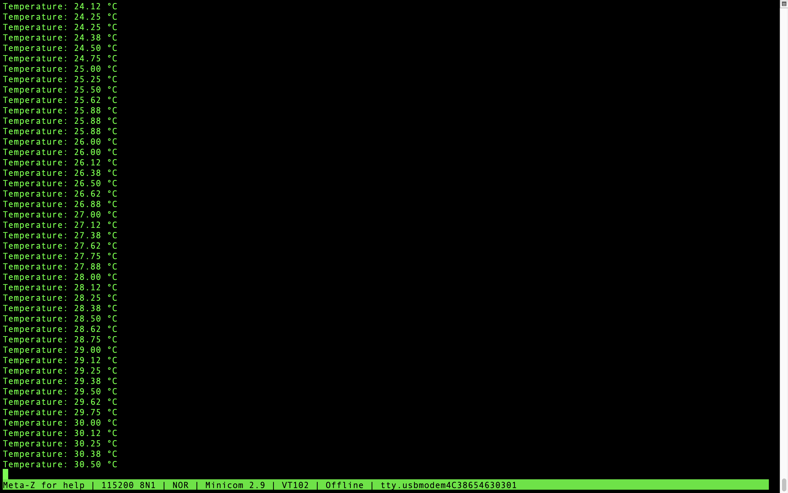

# LM75A_Temperature_Sensor
This repository contains an example project for reading temperature data from an LM75A temperature sensor using an STM32F103C8T6 microcontroller. The temperature data is transmitted over USB to a terminal emulator using the USB CDC class.
## Prerequisites

- STM32CubeIDE: Used for compiling and uploading the project to the microcontroller.
- LM75A temperature sensor: Connected to the I2C1 bus of the STM32F103C8T6.
- USB cable: To connect the STM32F103C8T6 to a computer for USB CDC communication.
- Terminal emulator: Such as PuTTY or Tera Term, to view the temperature data.
## LM75A Cable Connection
| LM75A | Board  |
|-------|--------|
|  SDA  |  SDA   |
|  SCL  |  SCL   |
|  GND  |  GND   |
|  VCC  |  3.3V  |
## Code Explanation
```c
#define LM75A_ADDRESS 0x48 << 1
#define LM75A_TEMP_REGISTER 0x00
```
`#define LM75A_ADDRESS 0x48 << 1`

- LM75A_ADDRESS: This macro defines the I2C address of the LM75A temperature sensor.
- 0x48: The base 7-bit address of the LM75A sensor in hexadecimal format.
- << 1: This shifts the 7-bit address one bit to the left, converting it to an 8-bit address format. In I2C communication, the address is 7 bits, but it needs to be shifted left by one bit to make room for the read/write bit, which is the least significant bit (LSB) in the I2C address byte.
- Result: After shifting, the 7-bit address 0x48 (binary 01001000) becomes 0x90 (binary 10010000), which is the 8-bit address format required for I2C communication.

`#define LM75A_TEMP_REGISTER 0x00`

- LM75A_TEMP_REGISTER: This macro defines the register address within the LM75A sensor where the temperature data can be read.
- 0x00: The specific register address for the temperature data in the LM75A sensor. This is typically the default register that holds the temperature measurement data.
### LM75A_ReadTemperature Function

This function is used to read temperature data from the LM75A temperature sensor and convert it into a Celsius degree value. The function uses the I2C protocol to retrieve data from the sensor and returns it as a meaningful temperature value.
```c
float LM75AReadTemperature(I2C_HandleTypeDef *hi2c1)
{
	uint8_t temp_data[2];
	HAL_I2C_Mem_Read(hi2c1, LM75A_ADDRESS, LM75A_TEMP_REGISTER, I2C_MEMADD_SIZE_8BIT, temp_data, 2, HAL_MAX_DELAY);

	int16_t temp_raw = (temp_data[0] << 8) | temp_data[1];
	temp_raw >>= 5;

	float temperature = temp_raw * 0.125;

	return temperature;
}
```
- I2C_HandleTypeDef *hi2c: This parameter contains the configuration used for I2C communication. It is used to manage I2C operations in the HAL library.
- `uint8_t temp_data[2];`
Defines a two-byte array. This array is used to store the temperature data read from the sensor.
- `HAL_I2C_Mem_Read(hi2c, LM75A_ADDRESS, LM75A_TEMP_REGISTER, I2C_MEMADD_SIZE_8BIT, temp_data, 2, HAL_MAX_DELAY);`HAL_I2C_Mem_Read: This function reads data from a device (LM75A) over I2C. Parameters:
    - `hi2c` : I2C communication configuration.
    - `LM75A_ADDRESS` : The I2C address of the LM75A.
    - `LM75A_TEMP_REGISTER` : The register address where the temperature data is located.
    - `I2C_MEMADD_SIZE_8BIT` : The size of the register address (8-bit).
    - `temp_data` : The array where the read data will be stored.
    - `2` : The number of bytes to read.
    - `HAL_MAX_DELAY` : The maximum time to wait for the operation to complete (blocking function).
- `int16_t temp_raw = (temp_data[0] << 8) | temp_data[1];`
    - `temp_data[0] << 8` : Shifts the first byte (MSB) 8 bits to the left to make it more significant.
    - `| temp_data[1]` : Combines it with the second byte (LSB). This operation merges the two bytes into a 16-bit value.
- `temp_raw >>= 5;`
 Shifts the data 5 bits to the right to make it signed. The LM75A sensor provides 11-bit resolution, and the most significant 11 bits carry the temperature data. The rightmost 5 bits are insignificant and thus discarded.
 - `float temperature = temp_raw * 0.125;` temp_raw * 0.125: The temperature value, with 11-bit resolution, where each bit represents 0.125°C. Thus, multiplying the raw value by 0.125 converts it to degrees Celsius.
### SendTemperatureOverUsb Function
This function sends the measured temperature value over USB to a terminal emulator.
```c
void SendTemperatureOverUsb(float temperature)
{
	char buffer[50];
	int len = sprintf(buffer,"Temperature: %.2f °C\r\n", temperature);
	CDC_Transmit_FS((uint8_t*)buffer, len);
}
```
- `char buffer[50];` This line declares a character array named `buffer` with a size of 50. This array will be used to store the formatted temperature string before sending it over USB.

- `int len = sprintf(buffer, "Temperature: %.2f °C\r\n", temperature);`
    - `sprintf` : This function formats a string and stores it in the buffer array.

        - `buffer` : The array where the formatted string will be stored.
        - `temperature` : The temperature value to be inserted into the formatted string at the position of %.2f
    - `int len` : This variable holds the length of the formatted string, which is returned by the sprintf function.

- `CDC_Transmit_FS((uint8_t*)buffer, len);` This function transmits data over the USB CDC (Communication Device Class) interface.
    - `(uint8_t)buffer*` : The `buffer` array is cast to a `uint8_t*` type, which is the expected type for the data pointer in the `CDC_Transmit_FS` function.
    - `len` : The length of the data to be transmitted, which was calculated by `sprintf` and stored in the len variable.

### Summary:
This code initializes an STM32 microcontroller to read temperature data from an LM75A sensor via I2C and transmit the data over USB. The main loop continuously reads the temperature and sends it every second.

## Usage
- Compile the code and upload it to the microcontroller.
- Start the minicom terminal.
- Observe the data coming from the sensor via the serial port.



## Contributing
If you would like to contribute, you can do so by sending a pull request.

## License
This project is licensed under the MIT License.